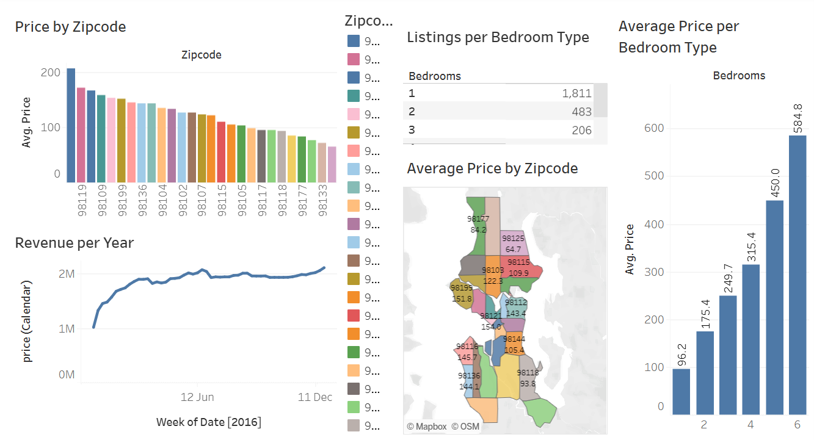

# Airbnb Performance Dashboard - Tableau Visualization Project

---

---

## Project Overview

This project visualizes the performance of Airbnb listings using Tableau. It aims to uncover pricing patterns, occupancy trends, and geographic distributions that can inform business strategy for hosts and platform managers.

---

## Problem Statement ❓

With the increasing competition in the short-term rental market, Airbnb hosts and analysts need a clear understanding of what drives performance—such as optimal pricing, location-based demand, and property features. The project addresses how these factors influence booking success and revenue generation.

---

## Data Source and Transformation 🗂️

**Dataset:** The dataset [here](Tableau_Full_Project_Github.xlsx) contains the Airbnb listing data including location, pricing, property type, availability, and review metrics.

**Data Preparation:**

  - Cleaned and structured in Excel to remove duplicates, handle nulls, and standardize formats.

  - Loaded into Tableau for visual analysis. File attached [here](7.Airbnb_Tableau_Project.twb).

  - Created calculated fields and hierarchies for filtering and drill-down insights.

---

## Data Analysis 📊

The Tableau dashboard includes:

- **Geographic Distribution Map:** Visualizes listings by zip code and neighborhood.

- **Price Analysis:** Comparison of average nightly prices across property types and room categories.

- **Availability Trends:** Monthly and yearly patterns in listing availability.

- **Review Analysis:** Correlation between review scores and occupancy.

- **Filters & Interactivity:** Dynamic slicers for zip code, bedroom count, and price ranges.

Tableau Dashboard shown below: 

---

## Key Metrics and Findings 📌

- Top-performing zip codes in terms of average occupancy and revenue.

- Price bands that correlate with higher booking frequency.

- Room types (e.g., entire home vs. private room) showing distinct performance differences.

- Seasonal trends in availability and booking behavior.

- Impact of reviews on listing popularity and pricing strategy.

---

## Insights & Recommendations 💡

- Listings in certain high-demand zip codes command higher prices and occupancy.

- Hosts can increase competitiveness by adjusting prices based on seasonality and review strength.

- Entire home rentals consistently outperform other room types in terms of revenue.

- Hosts should improve review scores to drive better engagement and higher nightly rates.

I have included the [link](https://public.tableau.com/app/profile/chiamaka.okonkwo/viz/Airbnb_Tableau_Project_17426121003070/Dashboard1) to the data visualization on my Tableau Public dashboard for reference.

## Conclusion

The Airbnb Tableau project provides powerful, interactive insights into what drives success on the platform. With visual storytelling, stakeholders can quickly assess opportunities, identify gaps, and make data-backed decisions to optimize listing performance.

